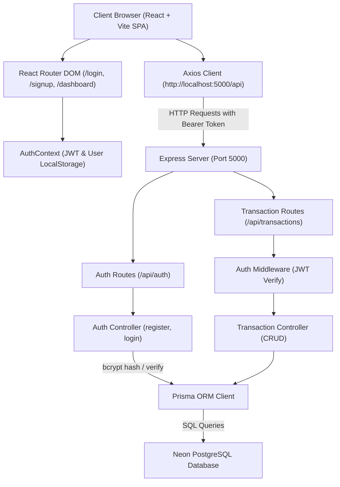
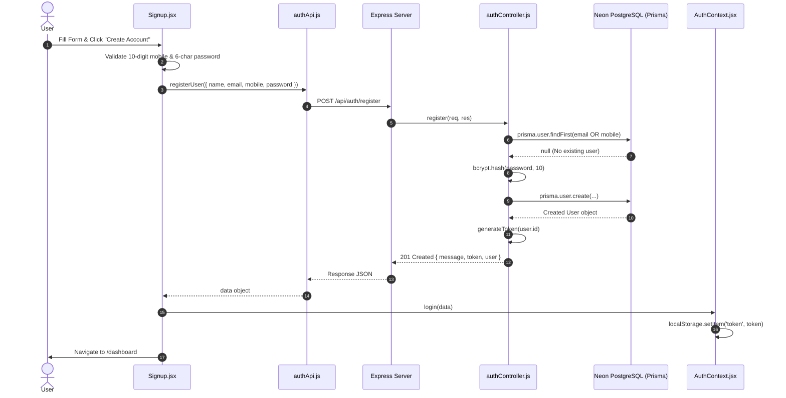
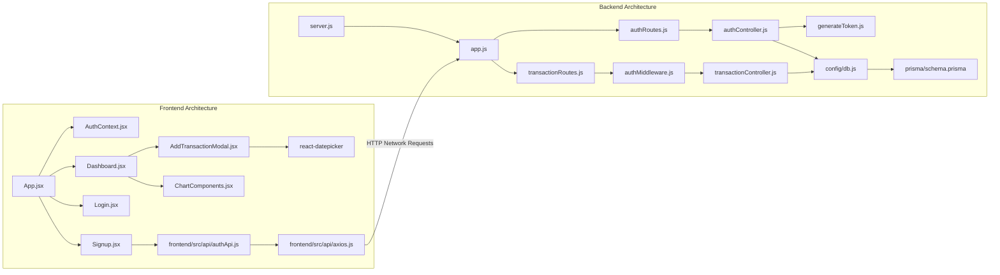

# Expense Tracker Project Documentation

> **Document Type:** Senior Architecture & Technical Developer Manual  
> **Target Audience:** Incoming Developers, Technical Lead, System Auditors  
> **Coverage:** 100% Codebase Analysis (Backend, Frontend, Database, Configuration & Documentation)

---

## 1. Project Overview

### Purpose of the Project
The **Expense Tracker** is a modern full-stack web application designed for personal financial management. It allows users to manage income and expense transactions, categorize spending, track total account balances, set budgets, and visualize financial habits through interactive dashboard metrics.

### Main Features
- **User Authentication:** Registration and authentication via Email or 10-digit Mobile Number with encrypted password storage.
- **Transaction Management:** Full CRUD operations for financial records (Income and Expense) with category tagging, transaction dates, descriptions, and optional receipt image attachments.
- **Financial Dashboard:** Real-time summary cards displaying Total Transactions, Total Income, Total Expenses, and Net Balance calculations.
- **Visual Analytics System:** Integrated Recharts components (Line, Bar, and Pie charts) for visual category breakdown and trend analysis.
- **Modern Responsive Interface:** Glassmorphism-inspired UI designed using Tailwind CSS, Framer Motion animations, and Lucide React icons.

### Current Development Status
- **Backend (API):** ~85% Completed. Core authentication controllers, transaction controllers, JWT middleware, Express server setup, and Prisma ORM schemas connected to a Neon PostgreSQL database are operational.
- **Frontend (UI):** ~65% Completed. UI layouts, modals, component systems, and client routing are built. Registration (`Signup.jsx`) connects to the backend API. Login (`Login.jsx`) and Dashboard (`Dashboard.jsx`) currently operate on mock/local React state rather than active API endpoints.
- **Overall Completion:** **~70% Ready**.

### Technologies Used

| Tier | Technology / Library | Role / Usage |
|---|---|---|
| **Frontend Core** | React 18, Vite 5 | SPA UI library & fast build tool |
| **Frontend Styling** | Tailwind CSS 3.3, PostCSS, Autoprefixer | Utility-first styling & custom CSS design tokens |
| **Frontend Animations** | Framer Motion 10 | Smooth transitions, modal entry, and interactive micro-animations |
| **Icons & Visuals** | Lucide React | Modern SVG icons |
| **Data Visualization** | Recharts 2.10 | Responsive charts (Line, Bar, Pie) |
| **Date Pickers** | react-datepicker, date-fns | Interactive calendar date selection |
| **Routing** | React Router DOM 6 | Single-Page Application client routing |
| **HTTP Client** | Axios 1.16 | Promise-based HTTP client with request interceptors |
| **Backend Core** | Node.js, Express 4.22 | RESTful API web application framework |
| **Database & ORM** | PostgreSQL (Neon Serverless), Prisma ORM 5.22 | Relational database engine & type-safe schema builder |
| **Security & Auth** | JSON Web Tokens (jsonwebtoken 9), bcryptjs 3.0 | Token generation/validation & password hashing |
| **File Upload (Configured)**| Multer 2.1 | Multipart form data parsing for receipt image uploads |
| **Dev Tooling** | Nodemon 3.1, ESLint 8, Prettier 3 | Hot-reloading dev server & code quality linters |

### Folder Structure Overview

```
Expense_tracker/
├── backend/                  # Node.js Express REST API backend
│   ├── prisma/               # Prisma ORM schema & database migration scripts
│   ├── src/                  # Express server application source code
│   │   ├── api/              # [TECHNICAL DEBT] Misplaced frontend API client modules
│   │   ├── config/           # Database & environment configurations
│   │   ├── controllers/      # Route logic handlers for Auth and Transactions
│   │   ├── middleware/       # JWT Authentication middleware
│   │   ├── routes/           # Express router endpoints definition
│   │   └── utils/            # JWT token generator utilities
│   ├── .env                  # Environment variables (Database URL, JWT Secret, Port)
│   └── package.json          # Node.js dependencies and script definitions
├── docs/                     # Project documentation directory
│   ├── FRONTEND_DETAILED_DOCS.md
│   └── PROJECT_STRUCTURE_AND_FILES.md
├── frontend/                 # React Vite frontend application
│   ├── src/                  # React frontend source code
│   │   ├── api/              # Axios HTTP client instances & endpoint modules
│   │   ├── components/       # UI design components (Charts, Layout, Transactions, UI)
│   │   ├── context/          # React Context API state providers (AuthContext)
│   │   ├── hooks/            # Custom React hooks (useTheme, useLocalStorage, etc.)
│   │   ├── pages/            # View pages (Login, Signup, Dashboard)
│   │   ├── services/         # Alternative service-layer API abstraction
│   │   └── utils/            # Formatters, helpers, and color utility mappings
│   ├── index.html            # Vite HTML main entry template
│   ├── tailwind.config.js    # Design system color tokens and theme configuration
│   ├── vite.config.js        # Vite bundler setup and API proxy rules
│   └── package.json          # React dependencies and scripts
└── Expense_tracker.code-workspace # VS Code multi-root project configuration
```

---

## 2. Architecture

### System Architecture Diagram



### Flow Explanations

1. **Frontend Architecture:** Built as a single-page application using React 18 and Vite. State management is divided into **Global Authentication State** (`AuthContext.jsx`) and **Local Page/Component State** (`Dashboard.jsx`, `AddTransactionModal.jsx`). UI rendering uses Tailwind CSS utility classes with custom theme extension tokens defined in CSS variables.
2. **Backend Architecture:** Built using Express 4.x with a layered modular design: `Routes` $\rightarrow$ `Middleware` $\rightarrow$ `Controllers` $\rightarrow$ `Prisma DB Client`.
3. **Database Architecture:** Uses Neon PostgreSQL. Data modeling and migration management are handled by Prisma ORM (`schema.prisma`). It includes two relational tables (`User` and `Transaction`) with one-to-many cascade deletion rules and database indexing on query-heavy columns (`userId`, `date`).
4. **Authentication Flow:**
   - User inputs credentials on `Signup.jsx` or `Login.jsx`.
   - Request is dispatched to backend POST endpoints (`/api/auth/register` or `/api/auth/login`).
   - Backend hashes password with `bcryptjs` (salt round 10) or verifies password hash.
   - On success, `generateToken(user.id)` generates a 7-day JWT signed with `JWT_SECRET`.
   - Frontend stores token in `localStorage` under key `'token'` and updates `AuthContext`.
5. **Request Flow from Frontend to Backend:**
   - Axios instance (`src/api/axios.js`) intercepts outgoing HTTP requests.
   - If `localStorage.getItem('token')` exists, it sets header `Authorization: Bearer <token>`.
   - Express server parses request JSON via `express.json()` middleware.
   - For protected transaction routes, `authMiddleware.js` extracts the bearer token, verifies signature with `jwt.verify`, queries database for user matching `userId`, and attaches user record to `req.user`.
6. **Image Upload Flow (Architecture vs. Current Code):**
   - *Backend Config:* `multer` is listed in `package.json`, and `services/api.js` has `uploadService.uploadImage` using `multipart/form-data`.
   - *Current Implementation Status:* Image preview on `AddTransactionModal.jsx` uses client-side blob URLs (`URL.createObjectURL(file)`). An Express multer upload endpoint `/api/upload` is not yet registered in `app.js`. Receipt images are temporarily stored in local component state.

---

## 3. Folder-by-Folder Explanation

### Backend Directories

- **`backend/`**: Contains the complete Node.js backend server code, environment configuration, database models, and dependencies.
- **`backend/prisma/`**: Houses database schema definitions (`schema.prisma`) and automated migration scripts (`migrations/`).
- **`backend/src/`**: Primary backend code container.
- **`backend/src/api/`**: **[TECHNICAL DEBT]** Contains misplaced frontend client files (`authApi.js`, `axios.js`, `transactionApi.js`) using ES Module syntax.
- **`backend/src/config/`**: Contains database client instantiations (`db.js`), initializing the `@prisma/client` single instance.
- **`backend/src/controllers/`**: Route request handlers containing business logic, validation checks, database queries, and response formatting for users and transactions.
- **`backend/src/middleware/`**: Contains Express HTTP request interceptors, primarily `authMiddleware.js` for JWT header extraction and verification.
- **`backend/src/routes/`**: Contains Express router definitions mapping HTTP methods and URL routes to controller functions.
- **`backend/src/utils/`**: Helper utility modules, such as `generateToken.js` for signing JWT authentication payloads.

### Frontend Directories

- **`frontend/`**: Root of the React Vite single-page frontend application.
- **`frontend/src/`**: Application source code container.
- **`frontend/src/api/`**: Contains Axios HTTP client instance (`axios.js`) and module-specific API functions (`authApi.js`, `transactionApi.js`).
- **`frontend/src/components/`**: Modular React UI components divided into logical subfolders:
  - `components/charts/`: Recharts data visualization wrappers (`ChartComponents.jsx`, `StatCard.jsx`).
  - `components/layout/`: Navigation bars and sidebars (`Navbar.jsx`, `Sidebar.jsx`).
  - `components/transactions/`: Transaction modal forms (`AddTransactionModal.jsx`).
  - `components/ui/`: Atomic UI primitives (`Button`, `Card`, `Dialog`, `Input`, `Select`, `Badge`, `Alert`, `LoadingSpinner`, `Pagination`, `Skeleton`).
- **`frontend/src/context/`**: React Context API files for global state management (`AuthContext.jsx`).
- **`frontend/src/hooks/`**: Custom React hooks (`index.js`) providing reusable logic like `useTheme`, `useLocalStorage`, `useDebounce`, `usePagination`.
- **`frontend/src/pages/`**: Primary top-level view pages (`Login.jsx`, `Signup.jsx`, `Dashboard.jsx`).
- **`frontend/src/services/`**: Alternative service-layer API client (`api.js`) providing organized service objects (`authService`, `transactionService`, etc.).
- **`frontend/src/utils/`**: Helper utility functions (`helpers.js`) for currency formatting (`INR`), date formatting, category icon resolution, and color classes.

### Docs Directory

- **`docs/`**: Holds markdown project design specifications and file breakdown guides (`FRONTEND_DETAILED_DOCS.md`, `PROJECT_STRUCTURE_AND_FILES.md`).

---

## 4. File-by-File Documentation

### Root Files

#### [Expense_tracker.code-workspace](file:///c:/Users/Varshitha/MernProjects/Expense_tracker/Expense_tracker.code-workspace)
- **Purpose:** VS Code multi-root workspace file.
- **Responsibilities:** Configures editor settings for root repository access.
- **Functions/Classes:** N/A (JSON configuration).
- **Interactions:** Used by VS Code to open workspace.
- **API/DB/Validations:** None.
- **Imports/Exports:** None.
- **Future Improvements:** Add recommended workspace extensions (Prisma, Tailwind IntelliSense).

#### [.gitignore](file:///c:/Users/Varshitha/MernProjects/Expense_tracker/.gitignore)
- **Purpose:** Specifies untracked files for Git version control.
- **Responsibilities:** Ignores `node_modules`, `.env`, and build outputs.
- **Functions/Classes:** N/A.
- **Interactions:** Git version control system.
- **API/DB/Validations:** None.
- **Imports/Exports:** None.
- **Future Improvements:** Add IDE-specific ignore rules (`.vscode`, `.idea`).

---

### Backend Files

#### [backend/package.json](file:///c:/Users/Varshitha/MernProjects/Expense_tracker/backend/package.json)
- **Purpose:** Backend dependency manifest and script configuration.
- **Responsibilities:** Defines Node.js dependencies (`express`, `prisma`, `bcryptjs`, `jsonwebtoken`, `cors`, `dotenv`) and execution scripts (`dev`, `start`, `prisma:migrate`).
- **Functions/Classes:** N/A.
- **Interactions:** Executed by `npm`.
- **API/DB/Validations:** Configures `commonjs` module format.
- **Imports/Exports:** None.
- **Future Improvements:** Remove unused `mongodb` dependency.

#### [backend/.env](file:///c:/Users/Varshitha/MernProjects/Expense_tracker/backend/.env)
- **Purpose:** Contains sensitive backend environment variables.
- **Responsibilities:** Stores `PORT`, `DATABASE_URL` (Neon PostgreSQL connection string with SSL), and `JWT_SECRET`.
- **Functions/Classes:** N/A.
- **Interactions:** Loaded by `dotenv` in `server.js` and `db.js`.
- **API/DB/Validations:** Sensitive secret strings.
- **Imports/Exports:** None.
- **Future Improvements:** Remove hardcoded secrets from version control (add `.env.example`).

#### [backend/prisma/schema.prisma](file:///c:/Users/Varshitha/MernProjects/Expense_tracker/backend/prisma/schema.prisma)
- **Purpose:** Prisma ORM Data Model and Database Connection configuration.
- **Responsibilities:** Defines `User` and `Transaction` models, field data types, unique constraints, foreign keys, cascade rules, and indexes.
- **Functions/Classes:** `model User`, `model Transaction`, `enum TransactionType`.
- **Interactions:** Used by `prisma generate` to produce `@prisma/client`.
- **API/DB/Validations:** `email` unique, `mobile` unique, `userId` index, `date` index.
- **Imports/Exports:** Exports types to `@prisma/client`.
- **Future Improvements:** Add budget model, transaction category enum, and soft delete fields.

#### [backend/src/server.js](file:///c:/Users/Varshitha/MernProjects/Expense_tracker/backend/src/server.js)
- **Purpose:** Node.js application entry point script.
- **Responsibilities:** Loads `dotenv`, imports Express application from `app.js`, and binds to network `PORT`.
- **Functions/Classes:** `app.listen()`.
- **Interactions:** Imports `./app`.
- **API/DB/Validations:** Fallback PORT 5000.
- **Imports:** `dotenv`, `./app`.
- **Exports:** None.
- **Future Improvements:** Add graceful process shutdown handlers (`SIGTERM`, `SIGINT`).

#### [backend/src/app.js](file:///c:/Users/Varshitha/MernProjects/Expense_tracker/backend/src/app.js)
- **Purpose:** Express application initialization and middleware orchestrator.
- **Responsibilities:** Instantiates Express `app`, configures CORS, JSON parsing, URL encoding, registers API routes, defines `/health` check, and provides global 500 error handler.
- **Functions/Classes:** Anonymous middleware handlers.
- **Interactions:** Mounts `/api/auth` and `/api/transactions`.
- **API Endpoints Used:** GET `/health`.
- **Imports:** `express`, `cors`, `./routes/authRoutes`, `./routes/transactionRoutes`.
- **Exports:** `app` Express instance.
- **Future Improvements:** Add rate limiting, request logging (Morgan), and structured error responses.

#### [backend/src/config/db.js](file:///c:/Users/Varshitha/MernProjects/Expense_tracker/backend/src/config/db.js)
- **Purpose:** Database Client Connection singleton.
- **Responsibilities:** Instantiates and exports a single `PrismaClient` instance.
- **Functions/Classes:** `new PrismaClient()`.
- **Interactions:** Imported by controllers and middleware.
- **API/DB/Validations:** Connects to PostgreSQL database.
- **Imports:** `@prisma/client`.
- **Exports:** `prisma` instance.
- **Future Improvements:** Add database connection logging and connection lifecycle management.

#### [backend/src/utils/generateToken.js](file:///c:/Users/Varshitha/MernProjects/Expense_tracker/backend/src/utils/generateToken.js)
- **Purpose:** JWT creation utility.
- **Responsibilities:** Accepts `userId`, signs payload using `process.env.JWT_SECRET`, sets 7-day expiration (`7d`), and returns token string.
- **Functions/Classes:** `generateToken(userId)`.
- **Interactions:** Called by `authController.js` upon successful registration or login.
- **Imports:** `jsonwebtoken`.
- **Exports:** `{ generateToken }`.
- **Future Improvements:** Add token refresh logic and payload customization.

#### [backend/src/middleware/authMiddleware.js](file:///c:/Users/Varshitha/MernProjects/Expense_tracker/backend/src/middleware/authMiddleware.js)
- **Purpose:** Authentication guard middleware for protected endpoints.
- **Responsibilities:** Extracts Bearer token from HTTP `Authorization` header, decodes JWT, verifies signature, queries Prisma `user.findUnique`, and populates `req.user`.
- **Functions/Classes:** `authMiddleware(req, res, next)`.
- **Interactions:** Attached to `transactionRoutes.js`.
- **API/DB/Validations:** Validates token presence, token validity, and user existence in database.
- **Imports:** `jsonwebtoken`, `../config/db`.
- **Exports:** `authMiddleware`.
- **Future Improvements:** Improve error messaging differentiation (expired token vs malformed token).

#### [backend/src/controllers/authController.js](file:///c:/Users/Varshitha/MernProjects/Expense_tracker/backend/src/controllers/authController.js)
- **Purpose:** Handles HTTP authentication endpoints logic.
- **Responsibilities:** Performs user registration and login validation, checks user duplicates (`email` or `mobile`), hashes passwords using `bcrypt.hash`, verifies credentials using `bcrypt.compare`, signs tokens via `generateToken`, and returns user sanitised data.
- **Functions/Classes:** `register(req, res)`, `login(req, res)`.
- **Interactions:** Calls `prisma.user.findFirst`, `prisma.user.create`, and `generateToken`.
- **API Endpoints Handled:** POST `/api/auth/register`, POST `/api/auth/login`.
- **Validations:** Checks for missing email/mobile/password; verifies unique constraints.
- **Imports:** `bcryptjs`, `../config/db`, `../utils/generateToken`.
- **Exports:** `{ register, login }`.
- **Future Improvements:** Add field validation using Zod/Joi and email verification.

#### [backend/src/controllers/transactionController.js](file:///c:/Users/Varshitha/MernProjects/Expense_tracker/backend/src/controllers/transactionController.js)
- **Purpose:** Handles Transaction management endpoints logic.
- **Responsibilities:** Performs CRUD operations on user transactions. Ensures user isolation by filtering queries with `userId: req.user.id`.
- **Functions/Classes:** `createTransaction`, `getTransactions`, `updateTransaction`, `deleteTransaction`.
- **Interactions:** Interacts with `prisma.transaction`.
- **API Endpoints Handled:** POST `/api/transactions`, GET `/api/transactions`, PUT `/api/transactions/:id`, DELETE `/api/transactions/:id`.
- **Validations:** Checks presence of `amount`, `type`, and `date`; verifies transaction ownership.
- **Imports:** `../config/db`.
- **Exports:** `{ createTransaction, getTransactions, updateTransaction, deleteTransaction }`.
- **Future Improvements:** Add transaction pagination, date range filtering, and bulk operations.

#### [backend/src/routes/authRoutes.js](file:///c:/Users/Varshitha/MernProjects/Expense_tracker/backend/src/routes/authRoutes.js)
- **Purpose:** Maps authentication endpoints to controller actions.
- **Responsibilities:** Defines `/register` and `/login` POST routes.
- **Imports:** `express`, `../controllers/authController`.
- **Exports:** Express router.
- **Future Improvements:** Add route-level validation middleware.

#### [backend/src/routes/transactionRoutes.js](file:///c:/Users/Varshitha/MernProjects/Expense_tracker/backend/src/routes/transactionRoutes.js)
- **Purpose:** Maps transaction management endpoints.
- **Responsibilities:** Applies `authMiddleware` to all transaction routes and maps `/` and `/:id` paths to `transactionController`.
- **Imports:** `express`, `../middleware/authMiddleware`, `../controllers/transactionController`.
- **Exports:** Express router.
- **Future Improvements:** Add query parameter filters for date ranges and categories.

#### [backend/src/api/authApi.js](file:///c:/Users/Varshitha/MernProjects/Expense_tracker/backend/src/api/authApi.js), [backend/src/api/axios.js](file:///c:/Users/Varshitha/MernProjects/Expense_tracker/backend/src/api/axios.js), [backend/src/api/transactionApi.js](file:///c:/Users/Varshitha/MernProjects/Expense_tracker/backend/src/api/transactionApi.js)
- **Purpose:** **[TECHNICAL DEBT]** Misplaced frontend API files residing inside the backend tree.
- **Responsibilities:** Contains frontend Axios calls with ES Modules syntax (`import`/`export`).
- **Future Improvements:** Remove these files from `backend/src/api/` as they belong strictly to the frontend.

---

### Frontend Files

#### [frontend/package.json](file:///c:/Users/Varshitha/MernProjects/Expense_tracker/frontend/package.json)
- **Purpose:** Frontend React project manifest.
- **Responsibilities:** Configures React 18, Vite, Tailwind CSS, Framer Motion, Recharts, Axios, Lucide React, and Radix UI primitives.
- **Imports/Exports:** N/A.

#### [frontend/vite.config.js](file:///c:/Users/Varshitha/MernProjects/Expense_tracker/frontend/vite.config.js)
- **Purpose:** Vite project configuration.
- **Responsibilities:** Enables React plugin, sets port `3000`, and configures proxy rewrite rule `/api` $\rightarrow$ `http://localhost:5000`.

#### [frontend/tailwind.config.js](file:///c:/Users/Varshitha/MernProjects/Expense_tracker/frontend/tailwind.config.js)
- **Purpose:** Tailwind CSS design token configuration.
- **Responsibilities:** Configures `darkMode: ['class']`, extends color definitions with CSS HSL variables (`--primary`, `--accent`, `--card`), and adds shadow extensions (`glass`, `soft`, `medium`).

#### [frontend/postcss.config.js](file:///c:/Users/Varshitha/MernProjects/Expense_tracker/frontend/postcss.config.js)
- **Purpose:** PostCSS plugin configuration for Tailwind CSS and Autoprefixer parsing.

#### [frontend/index.html](file:///c:/Users/Varshitha/MernProjects/Expense_tracker/frontend/index.html)
- **Purpose:** Single Page Application HTML root template.
- **Responsibilities:** Defines DOM mount node `<div id="root"></div>` and loads `/src/main.jsx`.

#### [frontend/src/main.jsx](file:///c:/Users/Varshitha/MernProjects/Expense_tracker/frontend/src/main.jsx)
- **Purpose:** React DOM application root rendering entry point.
- **Responsibilities:** Mounts `<App />` into `document.getElementById('root')` wrapped in `<React.StrictMode>`.

#### [frontend/src/index.css](file:///c:/Users/Varshitha/MernProjects/Expense_tracker/frontend/src/index.css)
- **Purpose:** Global stylesheet and Tailwind design system layers.
- **Responsibilities:** Loads Google Font 'Inter', declares CSS HSL custom variables for light and dark themes, and defines utility classes (`.glass-effect`, `.gradient-primary`, `.card-hover`).

#### [frontend/src/App.jsx](file:///c:/Users/Varshitha/MernProjects/Expense_tracker/frontend/src/App.jsx)
- **Purpose:** Top-level application layout, authentication routing, and provider wrapper.
- **Responsibilities:** Renders `<AuthProvider>`, `<Router>`, defines `<ProtectedLayout>` (rendering `Sidebar` and `Navbar`), and configures React Router routes (`/login`, `/signup`, `/dashboard`).

#### [frontend/src/context/AuthContext.jsx](file:///c:/Users/Varshitha/MernProjects/Expense_tracker/frontend/src/context/AuthContext.jsx)
- **Purpose:** Global authentication state provider.
- **Responsibilities:** Manages `user` and `token` state, reads/writes credentials to `localStorage`, and provides `login()` and `logout()` helper functions. Provides custom hook `useAuth()`.

#### [frontend/src/hooks/index.js](file:///c:/Users/Varshitha/MernProjects/Expense_tracker/frontend/src/hooks/index.js)
- **Purpose:** Custom utility React hooks collection.
- **Responsibilities:** Exports `useLocalStorage`, `useTheme` (toggles `dark` class on root HTML), `useDebounce`, and `usePagination`.

#### [frontend/src/utils/helpers.js](file:///c:/Users/Varshitha/MernProjects/Expense_tracker/frontend/src/utils/helpers.js)
- **Purpose:** Formatting and category helper functions.
- **Responsibilities:** Exports `formatCurrency` (INR standard), `formatDate`, `getCategoryIcon`, `getCategoryColor`, `calculatePercentage`, `debounce`, and `formatNumberCompact`.

#### [frontend/src/api/axios.js](file:///c:/Users/Varshitha/MernProjects/Expense_tracker/frontend/src/api/axios.js)
- **Purpose:** Axios client instance configuration.
- **Responsibilities:** Instantiates Axios with `baseURL: 'http://localhost:5000/api'` and adds request interceptor attaching Bearer token from `localStorage`.

#### [frontend/src/api/authApi.js](file:///c:/Users/Varshitha/MernProjects/Expense_tracker/frontend/src/api/authApi.js)
- **Purpose:** Auth endpoint HTTP client functions.
- **Responsibilities:** Exports `registerUser(userData)` and `loginUser(userData)`.

#### [frontend/src/api/transactionApi.js](file:///c:/Users/Varshitha/MernProjects/Expense_tracker/frontend/src/api/transactionApi.js)
- **Purpose:** Transaction endpoint HTTP client functions.
- **Responsibilities:** Exports `fetchTransactions()`, `createTransaction(data)`, `updateTransaction(id, data)`, and `deleteTransaction(id)`.

#### [frontend/src/services/api.js](file:///c:/Users/Varshitha/MernProjects/Expense_tracker/frontend/src/services/api.js)
- **Purpose:** Alternative/expanded API service module.
- **Responsibilities:** Provides structured object exports (`authService`, `transactionService`, `budgetService`, `insightsService`, `uploadService`).

#### [frontend/src/pages/Signup.jsx](file:///c:/Users/Varshitha/MernProjects/Expense_tracker/frontend/src/pages/Signup.jsx)
- **Purpose:** User Account Registration Page Component.
- **Responsibilities:** Renders form with Full Name, Email, Mobile (10-digit limit), Password (min 6 chars), and Confirm Password. Performs client-side validations, calls `registerUser()` API, updates `AuthContext`, and navigates to `/dashboard`.

#### [frontend/src/pages/Login.jsx](file:///c:/Users/Varshitha/MernProjects/Expense_tracker/frontend/src/pages/Login.jsx)
- **Purpose:** User Authentication Page Component.
- **Responsibilities:** Form for Email/Mobile and Password.
- **Technical Debt Note:** Currently calls `login()` with empty arguments without making backend API request to `loginUser()`.

#### [frontend/src/pages/Dashboard.jsx](file:///c:/Users/Varshitha/MernProjects/Expense_tracker/frontend/src/pages/Dashboard.jsx)
- **Purpose:** Financial Dashboard View Page Component.
- **Responsibilities:** Displays summary cards (Total Transactions, Income, Expense), transaction list, and opens `AddTransactionModal`.
- **Technical Debt Note:** Manages transactions in local React state (`useState([])`) instead of dispatching Axios calls to backend `transactionApi`.

#### [frontend/src/components/layout/Navbar.jsx](file:///c:/Users/Varshitha/MernProjects/Expense_tracker/frontend/src/components/layout/Navbar.jsx)
- **Purpose:** Top Navigation Bar Component.
- **Responsibilities:** Displays application title, theme icon, notification badge, profile avatar, and Logout button.

#### [frontend/src/components/layout/Sidebar.jsx](file:///c:/Users/Varshitha/MernProjects/Expense_tracker/frontend/src/components/layout/Sidebar.jsx)
- **Purpose:** Collapsible Navigation Sidebar Component.
- **Responsibilities:** Renders navigation links (Dashboard, Transactions, Analytics, Insights, Settings) and mobile drawer toggle.

#### [frontend/src/components/transactions/AddTransactionModal.jsx](file:///c:/Users/Varshitha/MernProjects/Expense_tracker/frontend/src/components/transactions/AddTransactionModal.jsx)
- **Purpose:** Modal form for creating and editing transaction records.
- **Responsibilities:** Form fields for Amount, Type (Income/Expense), Category select dropdown, `react-datepicker` calendar, optional note textarea, and file receipt selector.

#### UI Primitives (`frontend/src/components/ui/`)
- **`Alert.jsx`**: Animated notification callout box with `error`, `success`, `info`, `warning` themes.
- **`Badge.jsx`**: Colored status badge indicator pill.
- **`Button.jsx`**: Customizable button supporting `primary`, `secondary`, `outline`, `ghost`, `danger`, `success` variants.
- **`Card.jsx`**: Flexible container box exposing `CardHeader`, `CardTitle`, `CardDescription`, `CardContent`, and `CardFooter`.
- **`Dialog.jsx`**: Framer-motion backdrop modal container.
- **`Input.jsx`**: Input field component with validation error text display.
- **`LoadingSpinner.jsx`**: Rotating CSS loading indicator.
- **`Pagination.jsx`**: Page navigation control bar with Previous/Next and numeric buttons.
- **`Select.jsx`**: Dropdown select component wrapper.
- **`Skeleton.jsx`**: Pulsing placeholder loader box.
- **`ChartComponents.jsx`**: Recharts wrappers (`LineChartComponent`, `BarChartComponent`, `PieChartComponent`, `AnimatedCounter`).
- **`StatCard.jsx`**: Metric card displaying formatted values, icons, and trend percentages.

---

## 5. Backend Documentation

### Authentication & Authorization
- **Authentication Method:** JSON Web Token (JWT) Bearer Tokens passed via `Authorization: Bearer <token>` HTTP header.
- **Token Generation:** Utility function `generateToken(userId)` signs token with payload `{ userId }` using secret `process.env.JWT_SECRET` with 7-day expiration (`7d`).
- **Password Hashing:** `bcryptjs` standard asynchronous hashing (`bcrypt.hash(password, 10)`). Hashes are compared during login using `bcrypt.compare(password, user.password)`.

### Database Integration (Prisma & PostgreSQL)
- **Connection Setup:** `src/config/db.js` initializes `@prisma/client`.
- **Connection String:** Provided by `DATABASE_URL` in `.env` linking to Neon PostgreSQL cloud instance (`sslmode=require`).

### Express Controllers & Logic
- **`authController.js`**:
  - `register`: Validates field presence, verifies user uniqueness across `email` and `mobile`, hashes password, inserts user into database, generates token, and returns 201 response.
  - `login`: Queries user by `email` OR `mobile`, verifies bcrypt password match, generates token, and returns 200 response.
- **`transactionController.js`**:
  - `createTransaction`: Parses `amount`, `type`, `category`, `description`, `date`, and assigns `userId: req.user.id`. Inserts via `prisma.transaction.create`.
  - `getTransactions`: Queries `prisma.transaction.findMany` filtering by `userId: req.user.id` ordered by date descending (`desc`).
  - `updateTransaction`: Verifies transaction existence and ownership before calling `prisma.transaction.update`.
  - `deleteTransaction`: Verifies transaction existence and ownership before calling `prisma.transaction.delete`.

### Middleware & Error Handling
- **`authMiddleware.js`**: Intercepts requests, validates header presence, executes `jwt.verify()`, queries database to check user existence, and assigns `req.user`. Returns `401 Unauthorized` on failure.
- **Global Error Handler:** Registered in `app.js` catching uncaught middleware/controller errors and returning `500 Internal Server Error`.

---

## 6. Frontend Documentation

### Routing & Guarded Layouts
React Router DOM configuration inside `App.jsx`:
- **Public Routes:** `/login` and `/signup` (redirects to `/dashboard` if user is already authenticated).
- **Protected Routes:** `/dashboard` wrapped in `<ProtectedLayout>` (redirects unauthenticated users to `/login`).

### State Management
- **Global Auth Context (`AuthContext.jsx`):** Manages `user` and `token` state synchronized with browser `localStorage`.
- **Page Component State (`Dashboard.jsx`):** Manages modal visibility, transaction arrays, and active editing records.

### Forms & Validations
- **Signup Form:** Validates mandatory fields, requires mobile to contain exactly 10 digits (`value.replace(/\D/g, '')`), password minimum length of 6 characters, and matching password confirmation.
- **Transaction Form:** Validates mandatory amount, type selection, category, and constrains transaction date up to current date using `react-datepicker`.

---

## 7. Database Documentation

### Schema Overview

```prisma
datasource db {
  provider = "postgresql"
  url      = env("DATABASE_URL")
}

model User {
  id           Int           @id @default(autoincrement())
  name         String?
  email        String?       @unique
  mobile       String?       @unique
  password     String
  budget       Float?
  avatar       String?
  createdAt    DateTime      @default(now())
  updatedAt    DateTime      @updatedAt
  transactions Transaction[]
}

model Transaction {
  id          Int             @id @default(autoincrement())
  title       String?
  description String?
  amount      Float
  type        TransactionType
  category    String?
  image       String?
  date        DateTime        @default(now())
  userId      Int
  createdAt   DateTime        @default(now())
  updatedAt   DateTime        @updatedAt
  user        User            @relation(fields: [userId], references: [id], onDelete: Cascade)

  @@index([userId])
  @@index([date])
}

enum TransactionType {
  income
  expense
}
```

### Relational Model & Indexes
- **One-to-Many Relationship:** One `User` can possess multiple `Transaction` records.
- **Cascade Deletion:** `onDelete: Cascade` ensures deleting a user automatically removes all associated transactions.
- **Database Indexes:**
  - `@@index([userId])`: Optimizes user transaction list retrieval.
  - `@@index([date])`: Speeds up date-range aggregation and chronological sorting.

---

## 8. API Endpoints Documentation

### 1. Register User
- **Method:** `POST`
- **URL:** `/api/auth/register`
- **Authentication Required:** No
- **Headers:** `Content-Type: application/json`
- **Request Body:**
  ```json
  {
    "name": "Jane Doe",
    "email": "jane@example.com",
    "mobile": "9876543210",
    "password": "securepassword123"
  }
  ```
- **Success Response (201 Created):**
  ```json
  {
    "message": "User registered successfully",
    "token": "eyJhbGciOiJIUzI1NiIsIn...",
    "user": {
      "id": 1,
      "name": "Jane Doe",
      "email": "jane@example.com",
      "mobile": "9876543210",
      "budget": null,
      "avatar": null
    }
  }
  ```
- **Error Responses:** 400 Bad Request ("User already exists"), 500 Internal Server Error.

### 2. Login User
- **Method:** `POST`
- **URL:** `/api/auth/login`
- **Authentication Required:** No
- **Headers:** `Content-Type: application/json`
- **Request Body:**
  ```json
  {
    "emailOrMobile": "jane@example.com",
    "password": "securepassword123"
  }
  ```
- **Success Response (200 OK):**
  ```json
  {
    "message": "User logged in successfully",
    "token": "eyJhbGciOiJIUzI1NiIsIn...",
    "user": {
      "id": 1,
      "name": "Jane Doe",
      "email": "jane@example.com",
      "mobile": "9876543210",
      "budget": null,
      "avatar": null
    }
  }
  ```
- **Error Responses:** 400 Bad Request ("Invalid credentials"), 500 Internal Server Error.

### 3. Create Transaction
- **Method:** `POST`
- **URL:** `/api/transactions`
- **Authentication Required:** Yes (`Authorization: Bearer <token>`)
- **Request Body:**
  ```json
  {
    "amount": 2500,
    "type": "expense",
    "category": "Food",
    "description": "Grocery shopping",
    "date": "2026-08-16T00:00:00.000Z"
  }
  ```
- **Success Response (201 Created):** Returns created transaction record object.
- **Error Responses:** 400 Bad Request ("Amount, type and date required"), 401 Unauthorized.

### 4. Get All User Transactions
- **Method:** `GET`
- **URL:** `/api/transactions`
- **Authentication Required:** Yes
- **Success Response (200 OK):** JSON array of transaction objects ordered by date descending.

### 5. Update Transaction
- **Method:** `PUT`
- **URL:** `/api/transactions/:id`
- **Authentication Required:** Yes
- **Success Response (200 OK):** Updated transaction object.
- **Error Responses:** 404 Not Found ("Transaction not found").

### 6. Delete Transaction
- **Method:** `DELETE`
- **URL:** `/api/transactions/:id`
- **Authentication Required:** Yes
- **Success Response (200 OK):** `{"message": "Transaction deleted successfully"}`.

---

## 9. Feature Implementation Matrix

| Feature | Completion Status | Key Files Involved | Description |
|---|---|---|---|
| **User Registration** | Completed | `Signup.jsx`, `authApi.js`, `authController.js` | Registers new user, hashes password, saves to Neon DB, returns JWT. |
| **User Login (Backend)** | Completed | `authController.js`, `authRoutes.js` | Verifies bcrypt password, returns JWT token and user info. |
| **User Login (Frontend)** | Incomplete / Mock | `Login.jsx` | Currently calls `login()` with missing arguments without invoking API. |
| **JWT Authentication Guard**| Completed | `authMiddleware.js`, `generateToken.js` | Validates JWT tokens on Express transactions routes. |
| **Transaction CRUD (Backend)**| Completed | `transactionController.js`, `transactionRoutes.js` | Full Express Prisma CRUD filtering by authenticated `userId`. |
| **Transaction CRUD (Frontend)**| Incomplete / Mock | `Dashboard.jsx`, `AddTransactionModal.jsx` | Manages transactions in component React memory state instead of API calls. |
| **Dashboard Metrics** | Partial | `Dashboard.jsx`, `StatCard.jsx` | Calculates real-time total income, total expenses, and item counts from local state. |
| **Receipt Image Upload** | Front-end Mock | `AddTransactionModal.jsx` | Client-side blob preview created; server Multer endpoint missing. |
| **Analytics & Insights Pages**| Not Started | `Sidebar.jsx`, `App.jsx` | Sidebar contains links (`/analytics`, `/insights`), but routes are missing. |

---

## 10. Current Workflow Sequence Diagrams

### Registration Flow Sequence



---

## 11. Dependency Documentation

### Backend Dependencies (`backend/package.json`)
- **`express` (`^4.22.2`)**: Fast Web framework for building Node REST APIs.
- **`@prisma/client` (`^5.22.0`)**: Type-safe auto-generated database client for Node.js.
- **`prisma` (`^5.22.0`)**: CLI tool for database migrations and schema prototyping.
- **`bcryptjs` (`^3.0.3`)**: Password hashing library for salt generation and hash verification.
- **`jsonwebtoken` (`^9.0.3`)**: Implementation of JSON Web Tokens for authentication headers.
- **`cors` (`^2.8.6`)**: Express middleware enabling Cross-Origin Resource Sharing for React client calls.
- **`dotenv` (`^16.6.1`)**: Environment variable reader from `.env` files into `process.env`.
- **`multer` (`^2.1.1`)**: Middleware for handling `multipart/form-data` file uploads.
- **`nodemon` (`^3.1.14`)**: Dev utility monitoring source code changes and auto-restarting Node.js server.
- **`mongodb` (`^7.2.0`)**: **[UNUSED]** Legacy driver artifact; can be safely removed as PostgreSQL is used.

### Frontend Dependencies (`frontend/package.json`)
- **`react` (`^18.2.0`) & `react-dom`**: Core React library for virtual DOM rendering.
- **`vite` (`^5.0.0`)**: Next-generation web application bundler and development server.
- **`react-router-dom` (`^6.20.0`)**: Declarative client routing library for React.
- **`axios` (`^1.16.0`)**: Promise-based HTTP client for browser requests.
- **`framer-motion` (`^10.18.0`)**: Production-ready animation engine for React UI components.
- **`recharts` (`^2.10.0`)**: Redefined chart library built with SVG React components.
- **`lucide-react` (`^0.294.0`)**: Icon library providing modern SVG interface icons.
- **`react-datepicker` (`^9.1.0`) & `date-fns`**: Accessible calendar component and date formatting library.
- **`tailwindcss` (`^3.3.0`), `postcss`, `autoprefixer`**: Atomic CSS framework toolchain.

---

## 12. Security Implementations

1. **Password Encryption:** Passwords are never stored as plain text. The backend hashes raw passwords with `bcryptjs` using a salt work factor of 10 prior to database insertion.
2. **JWT Authorization Guards:** Protected routes use `authMiddleware.js` to inspect HTTP `Authorization` headers. Unauthenticated or invalid token requests receive HTTP 401 Unauthorized errors.
3. **Environment Secrets Isolation:** Sensitive credentials (`DATABASE_URL`, `JWT_SECRET`) are stored in `.env` files rather than hardcoded in source code files.
4. **Input Constraints:** Frontend restricts mobile numbers strictly to 10 digits and validates password length before dispatching network calls.
5. **Database Cascading Protections:** Foreign key relation constraints maintain relational integrity and delete user transactions automatically upon user deletion.

---

## 13. Remaining Work

| Feature / Task | Current Progress | Missing Implementation | Required Files | Priority | Complexity |
|---|---|---|---|---|---|
| **Frontend Login API Integration** | 10% | Connect `Login.jsx` to dispatch `loginUser()` network request instead of dummy `login()`. | `Login.jsx`, `AuthContext.jsx` | **High** | Low |
| **Frontend Transaction API Integration** | 10% | Connect `Dashboard.jsx` to fetch transactions from backend on mount and sync create/update/delete. | `Dashboard.jsx`, `transactionApi.js` | **High** | Medium |
| **Multer Server Image Upload** | 20% | Create Express image upload endpoint `/api/upload` and serve static uploads directory. | `app.js`, `routes/uploadRoutes.js`, `controllers/uploadController.js` | **Medium** | Medium |
| **Missing App Routes** | 0% | Create missing pages (`Transactions`, `Analytics`, `Insights`, `Settings`) linked in Sidebar. | `App.jsx`, `pages/Analytics.jsx`, `pages/Transactions.jsx` | **Medium** | Medium |
| **Backend Cleanup** | 0% | Remove misplaced `backend/src/api/` folder. | `backend/src/api/*` | **High** | Low |

---

## 14. Technical Debt, Bugs & Anomalies

1. **`Login.jsx` Mock Submission Bug:** In `Login.jsx` (lines 38-40), form submit calls `login()` from `AuthContext` with no arguments without making a network request to `loginUser()`. This bypasses authentication and stores `undefined` user objects in `localStorage`.
2. **`backend/src/api/` Folder Misplacement:** Frontend client code (`authApi.js`, `axios.js`, `transactionApi.js`) using ES module syntax is present inside `backend/src/api/`. Node.js uses CommonJS (`require`), rendering these files non-functional in the backend.
3. **Dual API Abstraction Layers:** The frontend features two competing API call implementations: `src/api/*` (used by `Signup.jsx`) and `src/services/api.js` (unused). These should be unified into a single API layer.
4. **Vite Proxy Path Rewrite Discrepancy:** `vite.config.js` sets proxy rewrite `rewrite: (path) => path.replace(/^\/api/, '')`, stripping `/api` prefix. However, Express routes are registered with `/api/auth` in `app.js`. `src/api/axios.js` bypasses the proxy by requesting `http://localhost:5000/api` directly.
5. **Sidebar Visibility on Desktop:** In `Sidebar.jsx`, default state `isOpen` is `false`, applying `x: -320` which hides the sidebar off-screen on desktop viewports.

---

## 15. Future Development Roadmap

### Phase 1: Immediate Core Fixes (1 - 2 Weeks)
- [ ] Connect `Login.jsx` to backend POST `/api/auth/login`.
- [ ] Replace `Dashboard.jsx` local memory array with `transactionApi.fetchTransactions()`.
- [ ] Delete misplaced `backend/src/api/` folder.
- [ ] Unify frontend API layer into `src/api/`.

### Phase 2: Functional Enhancements (2 - 4 Weeks)
- [ ] Implement backend receipt file upload endpoint via `multer`.
- [ ] Create missing SPA view pages: `Transactions.jsx`, `Analytics.jsx`, `Settings.jsx`.
- [ ] Fix desktop `Sidebar.jsx` drawer layout responsiveness.
- [ ] Add User Profile edit and budget configuration options.

### Phase 3: Advanced Features & AI Suite (4 - 8 Weeks)
- [ ] **AI-Powered Insight Engine:** Integrate OpenAI / Gemini API to analyze monthly spending patterns and recommend savings strategies.
- [ ] **Automated Receipt OCR:** Extract transaction amount, merchant name, and date automatically from uploaded receipt images.
- [ ] **Export & Reports:** Add PDF / Excel financial report generation capabilities.

---

## 16. Code Relationships Diagram



---

## 17. Developer Notes & Conventions

### Coding Conventions
- **Modules System:** Backend uses **CommonJS** (`require`/`module.exports`). Frontend uses **ES Modules** (`import`/`export default`).
- **Formatting Standards:** Indentation is 2 spaces. Semicolons are omitted in frontend React components adhering to StandardJS style.
- **Naming Conventions:** React components use `PascalCase` (`AddTransactionModal.jsx`). Utility files and controllers use `camelCase` (`authController.js`, `generateToken.js`).
- **Styling Standards:** Tailwind utility classes are prioritized. Custom HSL CSS variables are configured in `index.css` for consistent dark/light mode compatibility.

### Extension Best Practices
1. **Adding New API Endpoints:** Create controller function in `backend/src/controllers/`, map route in `backend/src/routes/`, apply `authMiddleware` if protected, and register route path in `backend/src/app.js`.
2. **Adding New Database Tables:** Declare model in `backend/prisma/schema.prisma`, execute `npx prisma migrate dev --name <migration_name>`, and import `prisma` from `src/config/db.js`.
3. **Adding New Frontend Pages:** Create page component in `frontend/src/pages/`, register route path in `frontend/src/App.jsx`, and update menu item in `frontend/src/components/layout/Sidebar.jsx`.

---

## 18. Executive Summary

- **Project Completion Percentage:** **70%**
- **Core Strengths:** Clean modular architecture, database schema design, working registration API flow, modern animated design system, and complete reusable UI component kit.
- **Next Recommended Tasks:**
  1. Fix `Login.jsx` to call `loginUser()` API.
  2. Connect `Dashboard.jsx` state to `transactionApi.js`.
  3. Delete duplicate/misplaced `backend/src/api/` folder.
  4. Build server Multer receipt upload endpoint `/api/upload`.
